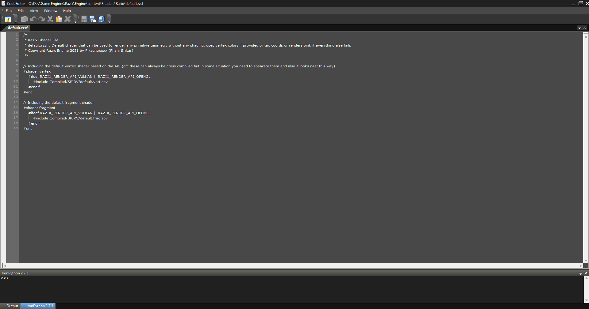

# [Razix](https://github.com/Pikachuxxxx/Razix) Code Editor
Shaders and Scripts editor for [**Razix Engine**](https://github.com/Pikachuxxxx/Razix). It provides language syntax sensitive editing for plain text, C#, Lua, GLSL, HLSL, PSSL, Python, XML, COLLADA and Cg files. It uses the ActiproSoftare SyntaxEditor to provide an editing Control. Built using [SonyWWS Atf](https://github.com/SonyWWS/ATF).

This is a custom modified version with additional features of the sample that is available here:
https://github.com/SonyWWS/ATF/wiki/ATF-Code-Editor-Sample, check this for detailed documentation of the base sample application.

## Features
- Syntax highlighting for the supported files types
- Intellisense for Razix API in lua and python(not supported yet!)
- Source control featu4res (local and perforce)
- Shader compilation and error highlighting
- Standard cut, copy and other file management operations
- Python 2.7 console for running python scripts and other commands
- Tab and layout management UI and custom skin themes
- Automatically opens the associated file types in the editor

## Screenshots

## License
Use Apache 2.0 License similar to [Razix Engine](https://github.com/Pikachuxxxx/Razix)
